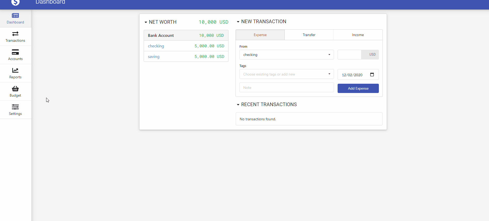

# How To Guide

### How to import from a text/csv file:
1. format of the file should be as follows:
date;account;category;total;currency;description;transfer
2. go to Settings -> DATA IMPORT -> Open File
3. choose the text file or csv file to import

###### Example File Without Transfers:

###### Example File With Transfer Between Accounts:

